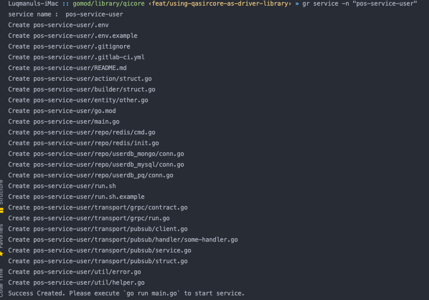

# CLI Skeleton Go Qasir

A tool that generates a skeleton service for qasir team



## Installation

Download QiCore by using:

```sh
$ go get -u github.com/qasir-id/qicore 
```

set GOPATH 

```sh
export GOPATH="$HOME/go"
export PATH="$GOPATH/bin:$PATH"
```
## Usage 

```sh
qicore service -n "service-name"
qicore gateway -n "gateway-name"
```
