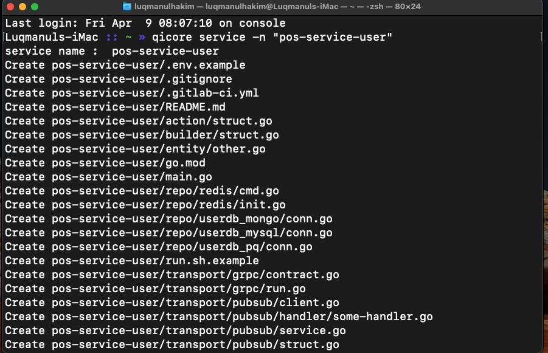

# CLI Skeleton Go Qasir

A tool that generates a skeleton service for qasir team



## Installation

Download QiCore by using:

```sh
$ go get -u github.com/qasir-id/qicore 
```

set GOPATH 

```sh
export GOPATH="$HOME/go"
export PATH="$GOPATH/bin:$PATH"
```
## Usage 

```sh
qicore service -n "service-name"
qicore gateway -n "gateway-name"
```

## Structure
### Gateway

```
├── domain
│   └── example
│       └── client
|           └── client.go
|       └── handler
|           └── ping.go
|       └── proto
|           └── example.pb.go
|           └── example.proto
│       └── binding.go
├── route
│   └── gate
│       └── ping.json
│   └── middleware
│       └── context_value.go
│   └── endpoint
│   └── middleware
│   └── route
├── util
│   └── helper.go
├── .env.example
└── .gitignore
└── .gitlab-ci.yml
└── Dockerfile
└── go.mod
└── main.go
└── README.md
```
### Service
```
├── action
│   └── example
│       └── example_test.go
│       └── example.go
|       └── handler.go
├── entity
│   └── example_pb.go
│   └── example.proto
├── repo
│   └── example_grpc
|       └── proto
|           └── example.proto
|       └── client.go
|       └── example.go
│   └── example_mongo
|       └── conn.go
│   └── example_mysql
|       └── conn.go
│   └── example_pq
|       └── conn.go
│   └── redis
|       └── client.go
|       └── conn.go
│   └── example_test.go
│   └── example.go
├── transport
│   └── grpc
│       └── run.go
│   └── pubsub
│       └── handler
│       └── client.go
│       └── service.go
│       └── struct.go
│   └── rabbitmq
│       └── handler
│       └── handler.go
│       └── run.go
├── util
│   └── error.go
│   └── helper.go
├── .env.example
└── .gitignore
└── .gitlab-ci.yml
└── Dockerfile
└── go.mod
└── main.go
└── README.md
```